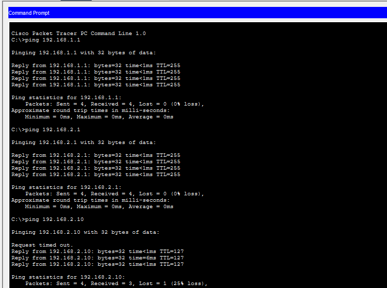

# Basic Routing Lab 01

## Objective
Configure a router to enable communication between two different networks.

---

## Topology

PC0 → Switch → Router → Switch → PC1

---

## IP Addressing

### Network 1
- 192.168.1.0/24
- PC0: 192.168.1.10
- Gateway: 192.168.1.1

### Network 2
- 192.168.2.0/24
- PC1: 192.168.2.10
- Gateway: 192.168.2.1

---

## Router Configuration
enable
configure terminal

interface gigabitEthernet0/0/0
ip address 192.168.1.1 255.255.255.0
no shutdown

interface gigabitEthernet0/0/1
ip address 192.168.2.1 255.255.255.0
no shutdown

---

## Results

Successfully configured routing between two networks.

Initial ping failed due to ARP resolution, then succeeded.

---

## What I Learned

- Routers connect different networks
- Default gateways are required
- ARP is used before communication begins
